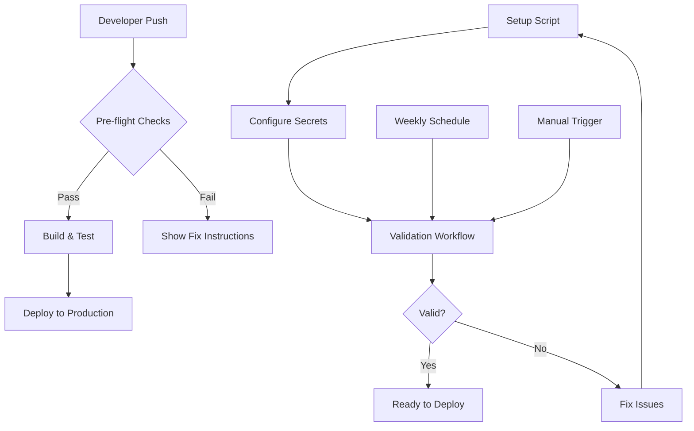

# Secret Management and CI/CD Pipeline Guide

**Last Updated:** 2025-08-29  
**Status:** Fully Implemented and Operational

## Table of Contents
- [Overview](#overview)
- [Quick Start](#quick-start)
- [Secret Management System](#secret-management-system)
- [Validation Workflows](#validation-workflows)
- [Pre-flight Checks](#pre-flight-checks)
- [Troubleshooting](#troubleshooting)
- [Security Best Practices](#security-best-practices)

## Overview

This guide documents the comprehensive secret management and CI/CD pipeline improvements implemented for the EspoCRM deployment system. The enhancements provide automated secret configuration, validation workflows, and robust pre-flight checks to ensure reliable deployments.

## Quick Start

### 1. Configure Secrets (One-Time Setup)

#### Option A: Automated Setup (Recommended)
```bash
# Run the interactive setup script
bash scripts/setup-github-secrets.sh
```

The script will:
- Detect your GitHub repository
- Find your kubeconfig file
- Validate the configuration
- Set up the required secrets
- Optionally run validation

#### Option B: Manual Setup
```bash
# 1. Generate the base64 encoded secret
base64 -w0 /home/brian/Dev/consigliere-dev-pack/ai-consigliere-dev_kubeconfig.yaml

# 2. Add to GitHub
# Go to: https://github.com/jakenelwood/espocrm-standalone/settings/secrets/actions
# Add new secret: KUBECONFIG_PRODUCTION
# Paste the base64 value
```

### 2. Validate Configuration
```bash
# Run the validation workflow
gh workflow run validate-secrets.yml --repo jakenelwood/espocrm-standalone

# Check the results
gh run watch --repo jakenelwood/espocrm-standalone
```

### 3. Deploy
```bash
# Push to main branch to trigger deployment
git push origin main

# Or manually trigger
gh workflow run deploy.yml --repo jakenelwood/espocrm-standalone
```

## Secret Management System

### Components

#### 1. Setup Script (`scripts/setup-github-secrets.sh`)

**Purpose:** Automates the entire secret configuration process

**Features:**
- Interactive prompts for user-friendly experience
- Auto-detection of repository and kubeconfig
- Validation before applying changes
- Support for updating existing secrets
- Optional validation workflow trigger

**Usage:**
```bash
bash scripts/setup-github-secrets.sh
```

**Process Flow:**
1. Checks prerequisites (gh CLI, authentication)
2. Detects or asks for repository
3. Finds or asks for kubeconfig location
4. Validates kubeconfig format
5. Checks for existing secrets
6. Sets/updates secrets via GitHub API
7. Offers to run validation workflow

#### 2. Required Secrets

| Secret Name | Description | How to Generate |
|------------|-------------|-----------------|
| `KUBECONFIG_PRODUCTION` | Base64 encoded kubeconfig for k3s cluster | `base64 -w0 < kubeconfig.yaml` |
| `KUBECONFIG_STAGING` | (Optional) Staging environment kubeconfig | `base64 -w0 < staging-kubeconfig.yaml` |

### Secret Storage

- **Location:** GitHub Repository Secrets
- **Access:** Repository admins only
- **Encryption:** Encrypted at rest by GitHub
- **Usage:** Automatically injected into workflow environment

## Validation Workflows

### Secret Validation Workflow (`.github/workflows/validate-secrets.yml`)

**Purpose:** Validates all required secrets and their contents

**Triggers:**
- Manual: `workflow_dispatch`
- Push to main/develop branches
- Weekly schedule (Mondays at 9 AM UTC)

**Validation Steps:**

1. **Secret Existence Check**
   - Verifies KUBECONFIG_PRODUCTION is set
   - Checks if value is non-empty
   - Reports character count for verification

2. **Content Validation**
   - Validates base64 encoding
   - Checks for valid YAML structure
   - Verifies required kubeconfig fields:
     - apiVersion
     - clusters
     - users
     - contexts
     - current-context

3. **Connectivity Test** (Optional)
   - Attempts cluster connection
   - Reports node and namespace counts
   - May fail due to network restrictions (expected)

4. **Summary Report**
   - Creates GitHub Actions summary
   - Provides actionable feedback
   - Links to configuration page

**Running the Validation:**
```bash
# Trigger manually
gh workflow run validate-secrets.yml --repo jakenelwood/espocrm-standalone

# View results
gh run list --repo jakenelwood/espocrm-standalone --workflow validate-secrets.yml

# Watch in real-time
gh run watch --repo jakenelwood/espocrm-standalone
```

## Pre-flight Checks

### Deployment Pre-flight System

The deployment workflow includes comprehensive pre-flight checks that run before any deployment attempt.

**Checks Performed:**

1. **Secret Validation**
   - Confirms KUBECONFIG_PRODUCTION exists
   - Reports secret size for verification

2. **Image Tag Validation**
   - Verifies image tag from build stage
   - Extracts first tag for deployment

3. **Manifest Validation**
   - Checks for required K8s manifests:
     - namespace.yaml
     - deployment.yaml
     - service.yaml
     - configmap.yaml

4. **YAML Syntax Validation**
   - Runs dry-run on all manifests
   - Reports any syntax errors

5. **Environment Validation**
   - Verifies GitHub SHA for versioning
   - Checks required environment variables

**Failure Handling:**
- Clear error messages with specific fixes
- Links to documentation
- Suggests running setup script
- Fails fast to save resources

## Troubleshooting

### Common Issues and Solutions

#### 1. "KUBECONFIG_PRODUCTION secret is not configured"

**Cause:** Secret hasn't been added to GitHub

**Solution:**
```bash
# Run the setup script
bash scripts/setup-github-secrets.sh

# Or manually add the secret
base64 -w0 /home/brian/Dev/consigliere-dev-pack/ai-consigliere-dev_kubeconfig.yaml
# Add to GitHub settings
```

#### 2. "KUBECONFIG_PRODUCTION is not valid base64"

**Cause:** Incorrect encoding (likely missing -w0 flag)

**Solution:**
```bash
# Re-encode with proper flags
base64 -w0 < your-kubeconfig.yaml
# Update the secret in GitHub
```

#### 3. "Could not connect to cluster"

**Cause:** Network restrictions from GitHub Actions

**Solution:**
- This is expected behavior
- The kubeconfig is valid, just not reachable
- Deployment will work when triggered

#### 4. "GitHub CLI is not authenticated"

**Cause:** gh CLI not logged in

**Solution:**
```bash
gh auth login
# Follow the prompts
```

#### 5. "Missing manifest: k3s/deployment.yaml"

**Cause:** Required Kubernetes manifests not found

**Solution:**
- Check that k3s/ directory exists
- Ensure all manifests are committed
- Verify file paths are correct

### Validation Workflow Issues

**Workflow not found:**
```bash
# Ensure the workflow file is pushed
git add .github/workflows/validate-secrets.yml
git commit -m "Add validation workflow"
git push origin main
```

**Permission denied:**
- Ensure you have admin access to the repository
- Check GitHub token permissions

### Setup Script Issues

**"Repository not found":**
- Check repository name format: `owner/repo`
- Ensure you have access to the repository

**"Could not find kubeconfig":**
- Manually specify the path when prompted
- Common locations:
  ```
  /home/brian/Dev/consigliere-dev-pack/ai-consigliere-dev_kubeconfig.yaml
  ~/.kube/config
  ~/.kube/config-ai-consigliere
  ```

## Security Best Practices

### Do's ✅

1. **Use GitHub Secrets**
   - Never commit sensitive data to the repository
   - Always use secrets for credentials

2. **Rotate Credentials**
   - Update kubeconfig when cluster credentials change
   - Re-run setup script to update secrets

3. **Limit Access**
   - Only grant repository admin to trusted users
   - Use GitHub Environments for additional control

4. **Audit Usage**
   - Review workflow runs regularly
   - Monitor for unauthorized changes

5. **Validate Before Use**
   - Run validation workflow after changes
   - Test in non-production first

### Don'ts ❌

1. **Never Commit Secrets**
   - Don't add kubeconfig files to git
   - Don't hardcode credentials

2. **Don't Share Secret Values**
   - Keep base64 values private
   - Don't log secret contents

3. **Don't Use Weak Credentials**
   - Ensure strong cluster authentication
   - Use service accounts with minimal permissions

4. **Don't Ignore Warnings**
   - Address validation warnings
   - Fix pre-flight check failures

## Workflow Integration

### How It All Works Together



### Deployment Flow

1. **Push to main** → Triggers deployment workflow
2. **Pre-flight checks** → Validates all prerequisites
3. **Build & test** → Creates and validates Docker image
4. **Security scan** → Trivy vulnerability scanning
5. **Deploy** → Updates k3s cluster
6. **Verify** → Health checks and monitoring

### Validation Flow

1. **Run setup script** → Configures secrets
2. **Validation workflow** → Verifies configuration
3. **Review results** → Check GitHub Actions summary
4. **Fix issues** → If validation fails
5. **Ready to deploy** → When all checks pass

## Maintenance

### Regular Tasks

#### Weekly
- Validation workflow runs automatically
- Review any warnings or failures

#### Monthly
- Review secret access logs
- Check for unused secrets
- Update documentation as needed

#### Quarterly
- Rotate cluster credentials
- Update kubeconfig secrets
- Review security practices

### Updating Secrets

```bash
# When cluster credentials change
bash scripts/setup-github-secrets.sh

# Verify the update
gh workflow run validate-secrets.yml --repo jakenelwood/espocrm-standalone
```

## References

### Related Documentation
- [CI/CD Auto-Deployment Setup](./cicd-auto-deployment-setup.md)
- [Deployment Failure Fix](./deployment-failure-fix-kubeconfig-secret.md)
- [Scripts README](../scripts/README.md)

### External Resources
- [GitHub Encrypted Secrets](https://docs.github.com/en/actions/security-guides/encrypted-secrets)
- [GitHub CLI Documentation](https://cli.github.com/manual/)
- [Kubernetes kubeconfig](https://kubernetes.io/docs/concepts/configuration/organize-cluster-access-kubeconfig/)

### Workflow Files
- [Deploy Workflow](../.github/workflows/deploy.yml)
- [Validation Workflow](../.github/workflows/validate-secrets.yml)

### Scripts
- [Setup Script](../scripts/setup-github-secrets.sh)

## Support

If you need help:

1. Run the validation workflow to identify issues
2. Check the troubleshooting section above
3. Review workflow logs in GitHub Actions
4. Ensure all prerequisites are installed
5. Verify repository permissions

---

*Documentation maintained by: DevOps Team*  
*Last review: 2025-08-29*